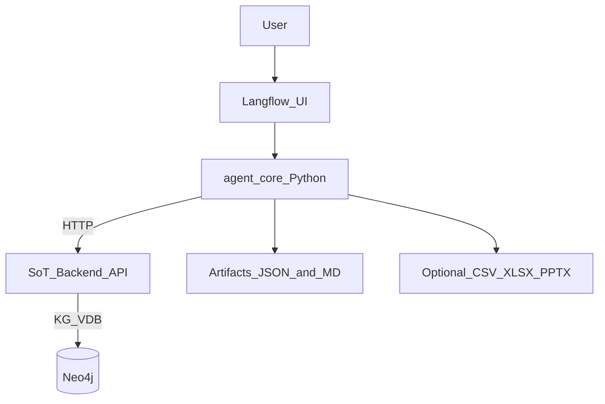

# Capture Agent Suite Repo Plan

## Goals

- Build a **separate repo** that contains “Shipley-next-step” agents (BOE workload drivers, proposal outline, kickoff brief, etc.).
- Produce **Option B outputs** by default: **schema-validated JSON** plus a **human-readable markdown briefing rendered from that JSON**.
- Keep it **simple for a non-expert**: most orchestration in **Langflow UI**, while a small Python core package provides reliability and maintainability.
- Do **not** rely on the current “skills router” pattern in the SoT repo.

## Non-Goals (for this initial setup)

- Multi-tenant auth, enterprise RBAC, or production SaaS hosting.
- Making LightRAG WebUI the agent interface.
- End-to-end PPTX generation in v1 (we will design the schema to support it, then add export later).

## Architecture (high level)

### Design choices

- **Langflow-first**: You will build and run agent flows visually.
- **Python core package** (small and stable):
  - Pydantic models (artifact schemas)
  - SoT API client
  - deterministic renderers (JSON → markdown)
  - exporters (JSON → CSV/XLSX now; PPTX later)
- **Single operator**: workspace and backend URL are config-driven.

## Repo layout (proposed)

- `README.md`
- `pyproject.toml` (Python 3.13+, uv)
- `src/agent_core/`
  - `config.py` (env-driven settings)
  - `sot_client.py` (HTTP client to SoT)
  - `schemas/`
    - `boe_workload_drivers.py` (Pydantic models)
    - `proposal_outline.py`
    - `common.py` (citations, evidence blocks, section anchors)
  - `renderers/`
    - `boe_workload_drivers_md.py`
    - `proposal_outline_md.py`
  - `exports/`
    - `boe_to_csv.py` / `boe_to_xlsx.py`
- `flows/` (Langflow exported JSON definitions)
  - `boe_workload_drivers_flow.json`
  - `proposal_outline_flow.json`
- `tests/` (very small set of contract tests)

## Integration contract with the Source-of-Truth backend

The Agent Suite should **not query Neo4j directly** initially.

Instead, standardize on a thin SoT API surface (configurable base URL), where each agent calls:

- a retrieval endpoint that returns **structured context** (entities + evidence)
- an enrichment endpoint (optional) that returns derived structure

**Assumption (default):** SoT backend reachable at `http://localhost:9621` and provides workspace-specific access via request parameters or headers.

If the SoT backend doesn’t yet expose the needed endpoints, we’ll treat it as a dependency and add them as a follow-up change in the SoT repo.

## Agent 1: BOE Workload Drivers (v1)

### Output contract

- Produce:
  - `BoeWorkloadDriversArtifact` (Pydantic JSON)
  - `artifact.md` rendered deterministically from JSON
  - optional `artifact.csv`/`artifact.xlsx`

### Retrieval strategy

- Ask SoT for requirement-like workload evidence scoped to:
  - a section anchor (e.g., “Appendix F”) or
  - a doc/section node selection
- Require SoT to return:
  - top-N relevant chunks with provenance
  - entity references (requirement/statement_of_work/section) where possible

### Langflow flow (minimal)

- Inputs: `workspace`, `scope_label` (e.g., Appendix_F), `audience=estimator`
- Steps:
  - Call SoT retrieval endpoint
  - Call LLM (Instructor/Pydantic) to fill `BoeWorkloadDriversArtifact`
  - Render markdown from JSON
  - Export CSV/XLSX (optional)

## Agent 2: Proposal Outline + Brainstorming (v1)

### Output contract

- Produce:
  - `ProposalOutlineArtifact` (Pydantic JSON)
  - `artifact.md` rendered deterministically from JSON

### Retrieval strategy

- Ask SoT for:
  - evaluation factors
  - submission instructions
  - strategic themes/pain points
  - key sections and relationships (L↔M mappings)

### Langflow flow (minimal)

- Inputs: `workspace`, `proposal_type` (default: “UCF”), `tone=consultative`
- Steps:
  - Call SoT retrieval endpoint(s)
  - Call LLM (Instructor/Pydantic) to produce outline + ideation blocks
  - Render markdown from JSON

## Quality guardrails (to keep it simple but reliable)

- **Schema-first**: every agent’s “final output” is a Pydantic model.
- **Render markdown from JSON** (no second independent generation pass).
- **Low temperature** defaults (0.1) for repeatability.
- **Evidence required**: every driver/outline item carries citations whenever available.
- **Versioning**: include `artifact_version` fields in each schema so you can evolve outputs safely.

## Minimal operational workflow

- Run SoT backend as you do today.
- Run Agent Suite locally:
  - open Langflow UI
  - select a flow
  - enter `workspace` + scope
  - download JSON/MD/CSV artifacts

## Implementation steps

1. **Create new repo** (Capture Agent Suite) with uv + Python 3.13+.
2. Add `agent_core` package with:

   - config/env handling
   - SoT API client
   - Pydantic schemas for BOE + Proposal Outline

3. Add deterministic markdown renderers.
4. Add exports (CSV first; XLSX if needed).
5. Add Langflow flows that call the Python core (not the other way around).
6. Add a tiny test suite:

   - schema validation tests
   - “rendering is deterministic” tests

7. Add docs and examples that mirror your “perfect run” workload response structure.

## Deliverables

- A new repo that can generate:
  - BOE workload drivers artifact (JSON + markdown + optional CSV/XLSX)
  - Proposal outline artifact (JSON + markdown)
- Langflow flows committed to git for repeatable orchestration.

## Follow-ups (after v1)

- Kickoff deck schema + PPTX export (likely `python-pptx`)
- Human-in-the-loop review UI (simple web page) if Langflow UI isn’t ideal for end users
- Workspace routing improvements (per-request workspace selection) and SoT API hardening