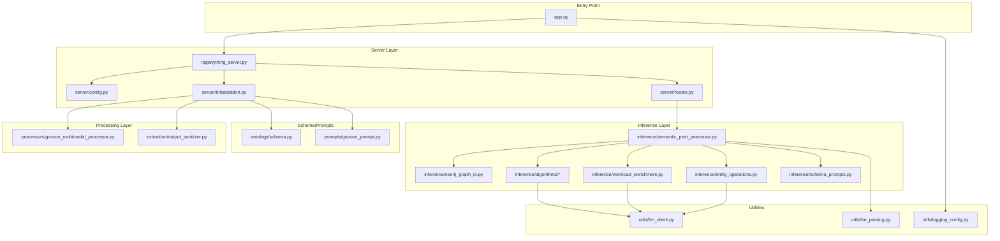

# Codebase Cleanup Overhaul

## Phase 1: Trace and Identify (Already Complete)

The dependency trace from `app.py` reveals the complete application flow:

---

## Phase 2: Remove Dead Code

### 2.1 Remove Empty/Orphaned Directories

| Directory | Status | Action |
|-----------|--------|--------|
| `src/query/` | Only `__pycache__` | **DELETE** |
| `src/reranking/` | Only `__pycache__` | **DELETE** |
| `prompts/query/` | Only `__pycache__` | **DELETE** |

### 2.2 Remove Unused Source Files

| File | Reason | Action |
|------|--------|--------|
| [`src/extraction/json_extractor.py`](src/extraction/json_extractor.py) | Only used by unused adapter | **DELETE** |
| [`src/extraction/lightrag_llm_adapter.py`](src/extraction/lightrag_llm_adapter.py) | Not used (output_sanitizer used instead) | **DELETE** |
| [`src/deduplication/entity_deduplicator.py`](src/deduplication/entity_deduplicator.py) | Not imported anywhere | **DELETE** |
| [`src/deduplication/__init__.py`](src/deduplication/__init__.py) | Parent module unused | **DELETE** |
| [`src/utils/structured_extractor.py`](src/utils/structured_extractor.py) | Standalone tool, not imported | **MOVE to tools/** |
| [`src/inference/relationship_operations.py`](src/inference/relationship_operations.py) | Not used in main flow | **EVALUATE** (may keep for future) |
| [`src/core/prompt_loader.py`](src/core/prompt_loader.py) | Only used by tests/docs | **EVALUATE** |

### 2.3 Update `__init__.py` Files

- [`src/extraction/__init__.py`](src/extraction/__init__.py) - Remove exports for deleted modules
- [`src/__init__.py`](src/__init__.py) - Remove any references to deleted modules

---

## Phase 3: Clean Up Root Directory

### 3.1 Remove Test Result Files (12 files)

| File | Action |
|------|--------|
| `agnostic_test.md` | **DELETE** |
| `ascii_test.md` | **DELETE** |
| `subsection_test.md` | **DELETE** |
| `contextual_test.md` | **DELETE** |
| `new_prompt_test.md` | **DELETE** |
| `balanced_prompt_test.md` | **DELETE** |
| `current_test_result.md` | **DELETE** |
| `webui_params_test.md` | **DELETE** |
| `mix_query_test.md` | **DELETE** |
| `naive_query_test.md` | **DELETE** |
| `perfect_run_test.md` | **DELETE** |
| `test_result.md` | **DELETE** |
| `broad_query_result.md` | **DELETE** |

### 3.2 Move Misplaced Files

| File | Action |
|------|--------|
| `test_pydantic_quick.py` | **MOVE to tests/** |
| `github_issue_050_reset_to_branch_022.md` | **MOVE to docs/archive/** |
| `requirements-upgraded.txt` | **DELETE** (using pyproject.toml) |

---

## Phase 4: Archive Old Code

| Directory/File | Action |
|----------------|--------|
| `archive/041a-pre-reset/` | **DELETE** (or move to git history) |
| `docs/archive/` | **REVIEW** - Keep only essential baselines |

---

## Phase 5: Clean Prompts Directory

### 5.1 Potentially Unused Prompts

| File | Used By | Action |
|------|---------|--------|
| `prompts/extraction/entity_detection_rules.md` | prompt_loader only | **EVALUATE** |
| `prompts/extraction/entity_extraction_prompt.md` | Not imported | **EVALUATE** |
| `prompts/extraction/grok_json_prompt.md` | Not imported | **DELETE** |

### 5.2 Keep These (Active)

- `prompts/extraction/govcon_lightrag_native.txt` - Main extraction prompt
- `prompts/govcon_prompt.py` - Loaded by initialization.py
- `prompts/relationship_inference/*.md` - Used by algorithms
- `prompts/user_queries/*.md` - User documentation

---

## Phase 6: Post-Cleanup Verification

1. Run `python app.py` to verify server starts
2. Run `python -m pytest tests/ -v` to verify tests pass
3. Check for any import errors
4. Verify Neo4j processing works

---

## Phase 7: Future Optimization (Phase 2)

After cleanup, these optimizations should be addressed:

### 7.1 DRY Violations in Algorithms

The 8 algorithm files in [`src/inference/algorithms/`](src/inference/algorithms/) share significant patterns:

- Similar LLM call patterns
- Duplicate validation logic
- Repeated prompt loading

**Recommendation**: Create shared utility functions in [`base.py`](src/inference/algorithms/base.py)

### 7.2 Consolidate LLM Calling

Multiple patterns exist for calling LLMs:

- [`src/utils/llm_client.py`](src/utils/llm_client.py) - Main utility
- Direct `openai_complete_if_cache` calls in initialization.py
- Direct `call_llm_async` calls scattered throughout

**Recommendation**: Route ALL LLM calls through `llm_client.py`

### 7.3 Schema Consolidation

Entity type definitions appear in multiple places:

- [`src/ontology/schema.py`](src/ontology/schema.py) - VALID_ENTITY_TYPES set
- [`src/server/config.py`](src/server/config.py) - global_args.entity_types list

**Recommendation**: Single source of truth in `schema.py`

---

## Expected Impact

| Metric | Before | After (Estimate) |
|--------|--------|------------------|
| Source files | ~45 | ~38 (-15%) |
| Lines of code | ~8,500 | ~7,200 (-15%) |
| Root test files | 13 | 0 |
| Empty directories | 3 | 0 |
| Unused modules | 6 | 0 |

