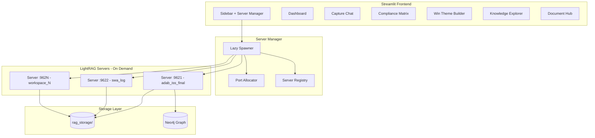

# GovCon Capture Intelligence UI

## Design Philosophy

**Not another generic chat UI.** This is a purpose-built capture command center that transforms RFP analysis into actionable intelligence. Every feature maps directly to a capture manager's workflow.

---

## Architecture Overview



---

## Workspace Server Management (Lazy Spawning)

**Problem**: LightRAG binds to a single workspace at startup. No runtime switching API exists.

**Solution**: Lazy server spawning - start a dedicated LightRAG server per workspace only when selected.

### Design Principles

1. **On-Demand Only**: Servers start when workspace is selected, not at app launch
2. **Scalable**: Supports 100s of workspaces without memory bloat
3. **Persistent Until Closed**: Server remains running until explicitly stopped
4. **Auto-Detection**: Scan `rag_storage/` for valid workspaces (has `kv_store_text_chunks.json`)

### Server Manager Implementation

```python
# capture_ui/services/server_manager.py

import subprocess
import requests
import time
from pathlib import Path
from typing import Dict, Optional
import logging

logger = logging.getLogger(__name__)

class WorkspaceServerManager:
    """Manages LightRAG server instances per workspace with lazy spawning"""
    
    BASE_PORT = 9621
    RAG_STORAGE_ROOT = Path("rag_storage")
    STARTUP_TIMEOUT = 60  # seconds
    
    def __init__(self):
        self.running_servers: Dict[str, dict] = {}  # workspace -> {port, process, pid}
        self.port_counter = 0
    
    def detect_workspaces(self) -> list[str]:
        """Auto-detect valid workspaces from rag_storage subdirectories"""
        workspaces = []
        for folder in sorted(self.RAG_STORAGE_ROOT.iterdir()):
            if folder.is_dir():
                # Valid workspace has processed chunks
                if (folder / "kv_store_text_chunks.json").exists():
                    workspaces.append(folder.name)
        return workspaces
    
    def get_server_status(self, workspace: str) -> dict:
        """Get status of a workspace server"""
        if workspace not in self.running_servers:
            return {"status": "stopped", "port": None}
        
        info = self.running_servers[workspace]
        try:
            resp = requests.get(f"http://localhost:{info['port']}/health", timeout=2)
            return {"status": "running", "port": info["port"]}
        except:
            # Process died unexpectedly
            del self.running_servers[workspace]
            return {"status": "stopped", "port": None}
    
    def start_server(self, workspace: str) -> str:
        """Start server for workspace (lazy spawning). Returns API URL."""
        # Already running?
        status = self.get_server_status(workspace)
        if status["status"] == "running":
            logger.info(f"Server for {workspace} already running on port {status['port']}")
            return f"http://localhost:{status['port']}"
        
        # Allocate port
        port = self.BASE_PORT + self.port_counter
        self.port_counter += 1
        
        # Start server process
        env = os.environ.copy()
        env["WORKSPACE"] = workspace
        env["PORT"] = str(port)
        env["WORKING_DIR"] = str(self.RAG_STORAGE_ROOT / workspace)
        
        logger.info(f"Starting LightRAG server for '{workspace}' on port {port}...")
        
        proc = subprocess.Popen(
            ["python", "app.py", "--port", str(port)],
            env=env,
            stdout=subprocess.PIPE,
            stderr=subprocess.PIPE,
        )
        
        self.running_servers[workspace] = {
            "port": port,
            "process": proc,
            "pid": proc.pid,
        }
        
        # Wait for startup
        api_url = f"http://localhost:{port}"
        for i in range(self.STARTUP_TIMEOUT):
            try:
                requests.get(f"{api_url}/health", timeout=1)
                logger.info(f"Server for '{workspace}' ready on port {port}")
                return api_url
            except:
                time.sleep(1)
        
        # Startup failed
        proc.kill()
        del self.running_servers[workspace]
        raise RuntimeError(f"Failed to start server for {workspace} within {self.STARTUP_TIMEOUT}s")
    
    def stop_server(self, workspace: str) -> bool:
        """Stop server for workspace (explicit close)"""
        if workspace not in self.running_servers:
            return False
        
        info = self.running_servers[workspace]
        logger.info(f"Stopping server for '{workspace}' (port {info['port']})...")
        
        try:
            info["process"].terminate()
            info["process"].wait(timeout=10)
        except:
            info["process"].kill()
        
        del self.running_servers[workspace]
        return True
    
    def get_active_servers(self) -> Dict[str, int]:
        """Return dict of workspace -> port for all running servers"""
        active = {}
        for workspace in list(self.running_servers.keys()):
            status = self.get_server_status(workspace)
            if status["status"] == "running":
                active[workspace] = status["port"]
        return active

# Singleton instance
server_manager = WorkspaceServerManager()
```

### UI Integration (Sidebar)

```python
# In sidebar.py

from services.server_manager import server_manager

# Workspace selection with server status
workspaces = server_manager.detect_workspaces()
active_servers = server_manager.get_active_servers()

st.sidebar.markdown("### Workspace")

# Show available workspaces with status indicators
for ws in workspaces:
    status = "🟢" if ws in active_servers else "⚪"
    col1, col2 = st.sidebar.columns([4, 1])
    
    with col1:
        if st.button(f"{status} {ws}", key=f"ws_{ws}"):
            with st.spinner(f"Starting {ws}..."):
                api_url = server_manager.start_server(ws)
                st.session_state.current_workspace = ws
                st.session_state.api_url = api_url
    
    with col2:
        if ws in active_servers:
            if st.button("✕", key=f"close_{ws}"):
                server_manager.stop_server(ws)
                if st.session_state.get("current_workspace") == ws:
                    st.session_state.current_workspace = None
                    st.session_state.api_url = None
                st.rerun()

# Show current workspace prominently
if st.session_state.get("current_workspace"):
    st.sidebar.success(f"Active: {st.session_state.current_workspace}")
```

### Server Status Display

```
┌─────────────────────────────────┐
│  Workspace                      │
├─────────────────────────────────┤
│  🟢 adab_iss_final     [✕]     │  ← Running, can close
│  ⚪ swa_log            [ ]     │  ← Stopped, click to start
│  ⚪ mcpp_drfp_2025     [ ]     │
│  ⚪ 1_adab_iss_2025    [ ]     │
│  ... (scrollable)              │
├─────────────────────────────────┤
│  ✓ Active: adab_iss_final      │
│    Port: 9621                   │
└─────────────────────────────────┘
```

### Memory Considerations

| Scenario | Memory Usage |

|----------|--------------|

| 1 workspace active | ~300-500MB |

| 5 workspaces active | ~1.5-2.5GB |

| 100 workspaces available, 3 active | ~1-1.5GB |

> **Note**: Only active (running) servers consume memory. Idle workspaces have zero footprint.

---

## Tech Stack Decision: Streamlit

| Consideration | Why Streamlit |

|--------------|---------------|

| Python-native | Matches your existing codebase |

| Rapid iteration | Change UI in minutes, not hours |

| Session state | Built-in conversation persistence |

| Multi-page apps | Native navigation without React routing |

| LightRAG API | Simple `requests` calls |

| Dark theme | `st.set_page_config(theme="dark")` + custom CSS |

---

## Visual Design: "Midnight Command"

**Theme**: Dark background (#0E1117) with **vibrant accent colors** that map to entity importance:

| Element | Color | Hex |

|---------|-------|-----|

| Background | Near Black | #0E1117 |

| Cards | Dark Slate | #1E2530 |

| Primary Accent | Electric Cyan | #00D4FF |

| Warning/Requirements | Amber | #FFB800 |

| Success/Win Themes | Emerald | #10B981 |

| Evaluation Factors | Violet | #8B5CF6 |

| Error/Mandatory | Coral | #FF6B6B |

---

## Pages and Features

### 0. Command Center (`pages/0_Command_Center.py`) - LANDING PAGE

**Purpose**: Cross-workspace portfolio overview. See everything at a glance BEFORE selecting a workspace.

**Features**:

**Portfolio Summary Cards**:

```
┌────────────────────────────────────────────────────────────────────┐
│  PORTFOLIO COMMAND CENTER                                          │
├────────────────┬────────────────┬────────────────┬────────────────┤
│  📁 Workspaces │  📊 Total Req  │  🔗 Relations  │  ⏰ Pending    │
│       12       │     1,847      │     3,291      │       2        │
├────────────────┴────────────────┴────────────────┴────────────────┤
│                                                                    │
│  WORKSPACE HEALTH MATRIX                                           │
│  ┌──────────────────┬───────┬────────┬───────┬────────┬────────┐  │
│  │ Workspace        │ Reqs  │ Clauses│ KG    │ Status │ Action │  │
│  ├──────────────────┼───────┼────────┼───────┼────────┼────────┤  │
│  │ 🟢 adab_iss_final│  234  │   45   │ 92%   │ Ready  │ [Open] │  │
│  │ 🟢 swa_log       │  189  │   38   │ 88%   │ Ready  │ [Open] │  │
│  │ 🟡 mcpp_drfp     │  312  │   52   │ 75%   │ Review │ [Open] │  │
│  │ ⚪ new_upload    │   --  │   --   │  --   │ Pending│ [Proc] │  │
│  └──────────────────┴───────┴────────┴───────┴────────┴────────┘  │
│                                                                    │
│  IDIQ CONTRACT FAMILIES                                            │
│  ┌─────────────────────────────────────────────────────────────┐  │
│  │ 🔗 AFCAP V (3 task orders)                                  │  │
│  │    Trend: Technical weight ↑12% across TOs                  │  │
│  │    Common themes: Mission continuity, rapid response        │  │
│  ├─────────────────────────────────────────────────────────────┤  │
│  │ 🔗 LOGCAP V (2 task orders)                                 │  │
│  │    Trend: Performance metrics becoming more stringent       │  │
│  └─────────────────────────────────────────────────────────────┘  │
│                                                                    │
│  COMPLIANCE STATUS ROLLUP                                          │
│  [████████████░░░░] 78% avg compliance across active workspaces   │
│  ⚠️ 3 workspaces have MANDATORY requirements without coverage     │
│                                                                    │
└────────────────────────────────────────────────────────────────────┘
```

**Key Metrics**:

- **Entity Counts Comparison**: Side-by-side requirement/clause/deliverable counts per workspace
- **KG Health Score**: Relationship density, entity completeness, inference quality (0-100%)
- **IDIQ Trend Analysis**: Cross-task-order patterns (factor weights, recurring themes)
- **Compliance Status Rollup**: Green/Yellow/Red per workspace with drill-down
- **Processing Queue**: Pending uploads and their estimated completion

**Interactions**:

- Click workspace row → Opens that workspace's Dashboard
- Click IDIQ family → Opens Portfolio page filtered to that contract
- Click compliance warning → Opens Compliance Matrix for that workspace

**Data Sources**:

- Workspace metadata files (`workspace_meta.json`)
- Neo4j aggregate queries across all workspaces
- Server manager status for processing state

---

### 1. Dashboard (`pages/1_Dashboard.py`) - WORKSPACE DETAIL

**Purpose**: At-a-glance opportunity health for a SINGLE selected workspace.

**Features**:

- **Workspace Header**: Contract name, solicitation number, due date countdown
- **Opportunity Scorecard**: Entity counts by type, processing status
- **Compliance Heatmap**: Section L requirements vs Section M factors coverage
- **Key Dates Timeline**: Events extracted from RFP (deadlines, milestones)
- **Quick Actions**: Jump to chat, view compliance matrix, export briefing
- **Back to Command Center**: Return to portfolio overview

**Data Source**: Neo4j queries via existing API for selected workspace

---

### 2. Capture Chat (`pages/2_Chat.py`)

**Purpose**: Conversational analysis with full memory and strategic persona.

**Features**:

- **Full Conversation History**: Unlimited turns stored in `st.session_state`
- **Query Mode Selector**: Local/Global/Hybrid/Mix (maps to LightRAG modes)
- **Suggested Prompts**: Pre-built capture-specific questions:
  - "What are the top 3 discriminators we should emphasize?"
  - "Summarize evaluation criteria by weight"
  - "What compliance risks exist in Section C?"
- **Export Chat**: Download conversation as Markdown for capture reviews
- **Source Citations**: Clickable references to original document sections

**API**: `POST /query` with `conversation_history` parameter

---

### 3. Compliance Matrix (`pages/3_Compliance.py`)

**Purpose**: Auto-generated L/M traceability (the capture manager's most time-consuming task).

**Features**:

- **Section L Instructions** (left column): Extracted `submission_instruction` entities
- **Section M Factors** (right column): Extracted `evaluation_factor` entities
- **Auto-Mapped Relationships**: Lines connecting L→M based on inference algorithm
- **Gap Indicators**: Highlight requirements without evaluation factor coverage
- **Export to Excel**: Standard compliance matrix format

**Data Source**: Neo4j relationship queries (your algo_1_instruction_eval.py already does this)

---

### 4. Win Theme Builder (`pages/4_WinThemes.py`)

**Purpose**: Synthesize strategic themes from extracted intelligence.

**Features**:

- **Extracted Themes**: Display all `strategic_theme` entities with type tags:
  - Hot Buttons (red)
  - Discriminators (purple)
  - Proof Points (green)
  - Win Themes (cyan)
- **Theme Generator**: AI-assisted prompt: "Based on the RFP analysis, suggest 3 additional win themes"
- **Theme-to-Requirement Mapping**: Show which requirements each theme addresses
- **Proposal Outline**: Auto-generate theme-organized proposal structure

**Data Source**: Neo4j entities + LightRAG chat for synthesis

---

### 5. Knowledge Explorer (`pages/5_Graph.py`)

**Purpose**: Visual exploration of extracted entities and relationships.

**Features**:

- **Interactive Graph**: Using `streamlit-agraph` or `pyvis`
- **Entity Filters**: Toggle visibility by type (requirements, clauses, etc.)
- **Relationship Paths**: Click entity to see all connections
- **Search**: Find specific entities by name

**Data Source**: Neo4j via `GET /graph/knowledge` endpoint

---

### 6. Document Hub (`pages/6_Documents.py`)

**Purpose**: Upload and manage RFP documents.

**Features**:

- **Drag-and-Drop Upload**: Multi-file PDF upload
- **Processing Status**: Real-time progress from pipeline
- **Document List**: All uploaded documents with metadata
- **Reprocess Button**: Re-run extraction with updated prompts

**API**: `POST /documents/upload`, `GET /documents/status`

---

### 7. Contract Portfolio (`pages/7_Portfolio.py`)

**Purpose**: Manage contract hierarchies (Standard vs IDIQ + Task Orders) and enable cross-contract intelligence.

**Why IDIQ Matters**: IDIQs let you prepare solutions in advance. When the IDIQ base is awarded, you know the contract vehicle, terms, and scope before task orders drop. This is a strategic advantage over standard one-off contracts.

**Features**:

**Contract Hierarchy View**:

```
┌─────────────────────────────────────────────────────┐
│  CONTRACT PORTFOLIO                                  │
├─────────────────────────────────────────────────────┤
│  📋 Standard Contracts (3)                           │
│    └ SWA Logistics Support (swa_log)                │
│    └ ADAB ISS Final (adab_iss_final)                │
│    └ MCPP DRFP 2025 (mcpp_drfp_2025)                │
│                                                      │
│  🔗 IDIQ Contracts (1)                               │
│    └─ AFCAP V Base Contract                          │
│       ├─ Task Order 001: ADAB Infrastructure         │
│       ├─ Task Order 002: Al Dhafra Support           │
│       └─ [+ New Task Order]                          │
└─────────────────────────────────────────────────────┘
```

**IDIQ Analysis Panel** (when IDIQ selected):

- **Base Contract Summary**: Core requirements, ceiling values, period of performance
- **Task Order Timeline**: Visual timeline of issued task orders
- **Delta Analysis**: What changes between base and each task order
  - New requirements added
  - Modified evaluation factor weights
  - Additional clauses incorporated
- **Trend Detection**: Patterns across task orders
  - Recurring requirement types
  - Factor weight shifts over time
  - Common discriminator themes

**Task Order Preparation Mode**:

- View IDIQ base requirements as "foundation"
- Identify reusable proposal content across task orders
- Track which clauses are inherited vs. task-specific
- Suggested prompts: "What base IDIQ requirements will likely appear in task orders?"

**Data Model** (from schema design):

```python
# Workspace metadata (workspace_meta.json in each rag_storage folder)
{
    "contract_type": "idiq" | "standard" | "task_order",
    "parent_contract": "afcap_v_base",  # For task orders only
    "hierarchy_level": 0 | 1,  # 0=base/standard, 1=task order
    "solicitation_number": "FA8003-24-R-0001",
    "award_date": "2024-03-15"
}
```

**Implementation Notes**:

- Workspace auto-detection scans for `workspace_meta.json` to determine hierarchy
- If no metadata file, treat as standard contract (backward compatible)
- IDIQ grouping is derived from `parent_contract` field
- Delta analysis queries Neo4j for entity/relationship differences

---

## Persona Selection (Lightweight Sidebar Feature)

**Purpose**: Modify chat behavior, suggested prompts, and dashboard focus based on capture team role.

**Implementation**: Sidebar dropdown that changes:

1. System prompt suffix sent to LLM
2. Suggested prompts library
3. Dashboard widget priority
4. Default entity type filters in Knowledge Explorer

### Persona Configurations

```python
PERSONAS = {
    "capture_manager": {
        "label": "Capture Manager",
        "icon": "🎯",
        "focus": "Win themes, competitive positioning, customer hot buttons, discriminators",
        "system_prompt": "You are briefing a Capture Manager. Focus on strategic insights, win themes, discriminators, and competitive positioning. Synthesize high-level themes rather than granular details.",
        "query_mode": "global",
        "entity_focus": ["strategic_theme", "evaluation_factor", "organization", "program"],
        "suggested_prompts": [
            "What are the top 3 discriminators we should emphasize?",
            "Identify customer hot buttons from evaluation criteria",
            "What incumbent advantages does this RFP favor?",
            "Suggest win themes based on the requirements",
        ],
    },
    "proposal_manager": {
        "label": "Proposal Manager",
        "icon": "📋",
        "focus": "Compliance matrices, proposal outlines, Section L/M mapping, page limits",
        "system_prompt": "You are briefing a Proposal Manager. Focus on compliance requirements, Section L instructions, evaluation factors, page limits, and proposal structure. Be precise about submission requirements.",
        "query_mode": "hybrid",
        "entity_focus": ["submission_instruction", "evaluation_factor", "section", "deliverable"],
        "suggested_prompts": [
            "What are the page limits for each volume?",
            "Map Section L instructions to Section M factors",
            "List all mandatory proposal sections",
            "What format requirements exist?",
        ],
    },
    "technical_cost_estimator": {
        "label": "Technical/Cost Estimator",
        "icon": "📊",
        "focus": "Technical approach driving BOE: workload drivers, labor hours, equipment, frequencies",
        "system_prompt": "You are briefing a Technical/Cost Estimator. Focus on quantitative data that drives the technical solution and subsequent cost estimate: labor drivers, quantities, frequencies, equipment counts, performance levels. Technical requirements lead - costs derive from technical. Be precise with numbers.",
        "query_mode": "mix",  # Mix retrieves both KG entities AND source chunks for precise numbers
        "entity_focus": ["requirement", "performance_metric", "equipment", "deliverable"],
        "suggested_prompts": [
            "What are the labor drivers for each task area?",
            "List equipment and material requirements with quantities",
            "What performance levels and SLAs are specified?",
            "Identify workload frequencies (daily, weekly, monthly)",
        ],
    },
    "contracts_manager": {
        "label": "Contracts Manager",
        "icon": "⚖️",
        "focus": "FAR/DFARS clauses, terms and conditions, regulatory compliance, CLINs",
        "system_prompt": "You are briefing a Contracts Manager. Focus on FAR/DFARS clauses, contract type, terms and conditions, regulatory requirements, and CLIN structure. Identify compliance risks and flow-down requirements.",
        "query_mode": "local",
        "entity_focus": ["clause", "section", "requirement"],
        "suggested_prompts": [
            "List all FAR/DFARS clauses by category",
            "What is the contract type and pricing structure?",
            "Identify IP and data rights requirements",
            "What flow-down clauses apply to subcontractors?",
        ],
    },
    "program_manager": {
        "label": "Program Manager",
        "icon": "📅",
        "focus": "CDRLs, deliverable schedules, reporting requirements, milestones",
        "system_prompt": "You are briefing a Program Manager. Focus on deliverables, CDRLs, reporting requirements, milestones, and schedule constraints. Emphasize what needs to be delivered and when.",
        "query_mode": "hybrid",
        "entity_focus": ["deliverable", "event", "performance_metric", "requirement"],
        "suggested_prompts": [
            "List all CDRLs with due dates and formats",
            "What are the key program milestones?",
            "Summarize reporting requirements by frequency",
            "What are the transition-in requirements?",
        ],
    },
    "proposal_writer": {
        "label": "Proposal Writer",
        "icon": "✍️",
        "focus": "Requirement details, technical specifications, deliverable descriptions",
        "system_prompt": "You are briefing a Proposal Writer. Provide detailed requirement language, technical specifications, and context needed to write compliant proposal sections. Include specific references to RFP sections.",
        "query_mode": "mix",
        "entity_focus": ["requirement", "statement_of_work", "submission_instruction", "deliverable"],
        "suggested_prompts": [
            "What are the detailed requirements for Task 3?",
            "Summarize the technical specifications in Section C",
            "What proof points should we emphasize?",
            "List requirements that mention specific technologies",
        ],
    },
}
```

### How Persona Affects the UI

| Component | Capture Manager | Technical/Cost Estimator | Contracts Manager |

|-----------|-----------------|--------------------------|-------------------|

| **Chat responses** | Strategic synthesis | Quantitative precision | Regulatory focus |

| **Query mode default** | Global | Mix (KG + source chunks) | Local |

| **Dashboard widgets** | Win themes, competitive | BOE metrics, workload | Clause summary |

| **Suggested prompts** | Strategy-focused | Numbers-focused | Compliance-focused |

| **Graph filters** | Themes, eval factors | Requirements, metrics | Clauses, sections |

> **Note**: Technical/Cost Estimator uses `mix` mode because workload drivers (labor hours, quantities, frequencies) are stored as fields within requirement entities AND in source document chunks. Mix retrieves both structured KG data and precise numbers from original text.

---

## Sidebar (Persistent Across All Pages)

```
┌─────────────────────────────────┐
│  🏛️ GovCon Capture Intelligence │
├─────────────────────────────────┤
│  🏠 COMMAND CENTER              │  ← Always visible, returns to overview
├─────────────────────────────────┤
│  WORKSPACES (click to start)    │
│  ┌───────────────────────┬───┐  │
│  │ 🟢 adab_iss_final     │ ✕ │  │  ← Running (port 9621)
│  │ ⚪ swa_log             │   │  │  ← Stopped
│  │ ⚪ mcpp_drfp_2025      │   │  │
│  │ ⚪ 1_adab_iss_2025     │   │  │
│  │ ... (scrollable)       │   │  │
│  └───────────────────────┴───┘  │
│  ✓ Active: adab_iss_final       │
│    Port: 9621                    │
├─────────────────────────────────┤
│  Persona: [dropdown]             │
│  ○ 🎯 Capture Manager            │
│  ○ 📋 Proposal Manager           │
│  ○ 📊 Tech/Cost Est.             │
│  ○ ⚖️ Contracts Mgr              │
│  ○ 📅 Program Manager            │
│  ○ ✍️ Proposal Writer            │
├─────────────────────────────────┤
│  Model: [dropdown]               │
│  ○ grok-4-1-fast-reasoning       │
├─────────────────────────────────┤
│  Query Mode: [radio]             │
│  ○ Mix (recommended)             │
│  ○ Hybrid                        │
│  ○ Local                         │
│  ○ Global                        │
│  (auto-set by persona)           │
├─────────────────────────────────┤
│  WORKSPACE PAGES (when active)   │
│  📊 Dashboard                    │
│  💬 Capture Chat                 │
│  ✅ Compliance Matrix            │
│  🎯 Win Themes                   │
│  🔗 Knowledge Explorer           │
│  📁 Documents                    │
│  📋 Portfolio                    │
├─────────────────────────────────┤
│  ⚙️ Settings                     │
│  📤 Export Session               │
└─────────────────────────────────┘
```

**Navigation Flow**:

1. App opens → Command Center (cross-workspace overview)
2. Click workspace row or "Open" button → Starts server, navigates to Dashboard
3. Workspace pages enabled only when a workspace is active
4. Click "Command Center" in sidebar → Returns to portfolio overview

---

## File Structure

```
capture_ui/
├── app.py                      # Main entry, page config, global CSS
├── config/
│   ├── personas.py             # PERSONAS dict with role-specific configs
│   └── settings.py             # App-wide settings (ports, paths, defaults)
├── services/
│   ├── server_manager.py       # Lazy server spawning and lifecycle management
│   └── workspace_registry.py   # Contract hierarchy detection and IDIQ grouping
├── pages/
│   ├── 0_Command_Center.py     # Cross-workspace portfolio overview (LANDING)
│   ├── 1_Dashboard.py          # Single workspace detail view
│   ├── 2_Chat.py
│   ├── 3_Compliance.py
│   ├── 4_WinThemes.py
│   ├── 5_Graph.py
│   ├── 6_Documents.py
│   └── 7_Portfolio.py          # Contract hierarchy + IDIQ analysis
├── components/
│   ├── sidebar.py              # Workspace selector + persona + server status
│   ├── chat_message.py         # Custom styled chat bubbles
│   ├── entity_card.py          # Reusable entity display
│   └── compliance_table.py     # L/M matrix component
├── api/
│   └── lightrag_client.py      # API wrapper with dynamic port routing
├── styles/
│   └── midnight.css            # Dark theme + vibrant accents
└── requirements.txt            # streamlit, requests, pandas, pyvis, psutil
```

---

## Key Design Decisions

### Why NOT React?

- Your codebase is Python-first
- Streamlit's multi-page apps cover all navigation needs
- No build step = faster iteration
- Session state handles conversation memory natively

### Why NOT Open WebUI?

- Generic chat interface - doesn't leverage your 18-entity ontology
- No compliance matrix, win theme builder, or capture-specific views
- Would require extensive customization anyway

### Adaptability Built-In

- Each page is independent (add/remove features easily)
- API client abstracted (swap LightRAG for different backend)
- CSS variables for theme changes
- Workspace isolation already in your Neo4j design

---

## Suggested Prompts (Now Persona-Aware)

Prompts are loaded dynamically from the active persona. The chat page displays only prompts relevant to the selected role:

```python
# In Chat page
persona = st.session_state.get("persona", "capture_manager")
prompts = PERSONAS[persona]["suggested_prompts"]

st.sidebar.markdown("### Quick Questions")
for prompt in prompts:
    if st.sidebar.button(prompt, key=prompt):
        # Auto-fill and submit
        handle_query(prompt)
```

This replaces the static `CAPTURE_PROMPTS` dict - prompts are now defined per-persona in `config/personas.py`.

---

## Implementation Order

| Phase | Deliverable | Effort |

|-------|-------------|--------|

| 1 | Core app skeleton + dark theme CSS | 0.5 day |

| 2 | **Server Manager** (lazy spawning, port allocation, lifecycle) | 1 day |

| 3 | **Command Center** (cross-workspace overview, health matrix, metrics) | 1-2 days |

| 4 | Persona config + sidebar with workspace/server status | 0.5 day |

| 5 | Workspace Dashboard (single workspace detail view) | 1 day |

| 6 | Chat page with persona-aware prompts and full memory | 1-2 days |

| 7 | Compliance Matrix (L/M mapping) + Excel export | 1-2 days |

| 8 | Win Theme Builder | 1 day |

| 9 | Document Hub | 1 day |

| 10 | **Contract Portfolio** (IDIQ hierarchy, task order analysis, trends) | 1-2 days |

| 11 | Export Suite (PowerPoint, Word) | 1 day |

| 12 | Knowledge Graph visualization (demo/wow factor) | 1-2 days |

**Total**: ~12-17 days for full implementation

> **Priority Note**: Phase 3 (Command Center) is the user's first impression - shows portfolio health at a glance. Phase 10 (Contract Portfolio) enables IDIQ analysis. Phase 12 (Graph) is for stakeholder demos.

---

## Design Decisions (Finalized)

### 1. Workspace Management: Lazy Server Spawning

- **Auto-detect** workspaces from `rag_storage/` subdirectories (must have `kv_store_text_chunks.json`)
- **Lazy spawning**: Server starts ONLY when workspace is selected
- **Persistent until closed**: Server remains running until user explicitly clicks "Close"
- **Scalable**: Supports 100s of workspaces - only active ones consume memory
- **Port allocation**: Dynamic ports starting from 9621, incrementing per active workspace
- **Rationale**: LightRAG binds to workspace at startup - no runtime switching API exists

### 2. Implementation Priority: Server Manager First

- Phase 2 (Server Manager) is critical infrastructure - all features depend on it
- Phases 3-9: Core functionality (chat, dashboard, compliance, win themes, documents)
- Phase 10: Knowledge Graph visualization (last)
- Rationale: Graph is a "wow factor" demo for non-believers, but text tools provide daily value

### 3. Export Formats

| Export Type | Format | Use Case |

|-------------|--------|----------|

| Compliance Matrix | Excel (.xlsx) | Proposal compliance tracking |

| Capture Review | PowerPoint (.pptx) | Gate reviews, leadership briefings |

| Analysis Reports | Word (.docx) | Detailed RFP analysis documentation |

| Chat Transcripts | Markdown (.md) | Quick sharing, version control |

**Libraries**: `openpyxl` (Excel), `python-pptx` (PowerPoint), `python-docx` (Word)

### 4. IDIQ Contract Hierarchy

**Problem**: IDIQs have parent-child relationships (base contract → task orders) that need special handling.

**Solution**: Workspace metadata file (`workspace_meta.json`) defines hierarchy:

```json
{
  "contract_type": "idiq",
  "parent_contract": null,
  "hierarchy_level": 0,
  "solicitation_number": "FA8003-24-R-0001"
}
```

**Hierarchy Levels**:

- `0` = Base contract (IDIQ or standard)
- `1` = Task order (links to parent via `parent_contract`)

**Strategic Value**:

- IDIQs allow "preparation in advance" - know contract vehicle before task orders drop
- Cross-task-order analysis reveals trends (recurring requirements, factor weight shifts)
- Reusable proposal content identification across task orders
- Inherited vs. task-specific clause tracking

**Backward Compatibility**: Workspaces without `workspace_meta.json` are treated as standard contracts.

---

## Dependencies (requirements.txt)

```
streamlit>=1.30.0
requests>=2.31.0
pandas>=2.0.0
psutil>=5.9.0             # Process management for server lifecycle
pyvis>=0.3.2              # Graph visualization
streamlit-agraph>=0.0.45  # Alternative graph component
openpyxl>=3.1.0           # Excel export
python-pptx>=0.6.21       # PowerPoint export
python-docx>=1.1.0        # Word export
```