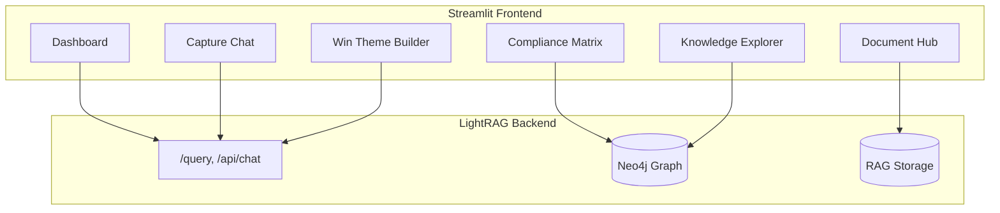

# GovCon Capture Intelligence UI

## Design Philosophy

**Not another generic chat UI.** This is a purpose-built capture command center that transforms RFP analysis into actionable intelligence. Every feature maps directly to a capture manager's workflow.

---

## Architecture Overview



---

## Tech Stack Decision: Streamlit

| Consideration | Why Streamlit |

|--------------|---------------|

| Python-native | Matches your existing codebase |

| Rapid iteration | Change UI in minutes, not hours |

| Session state | Built-in conversation persistence |

| Multi-page apps | Native navigation without React routing |

| LightRAG API | Simple `requests` calls |

| Dark theme | `st.set_page_config(theme="dark")` + custom CSS |

---

## Visual Design: "Midnight Command"

**Theme**: Dark background (#0E1117) with **vibrant accent colors** that map to entity importance:

| Element | Color | Hex |

|---------|-------|-----|

| Background | Near Black | #0E1117 |

| Cards | Dark Slate | #1E2530 |

| Primary Accent | Electric Cyan | #00D4FF |

| Warning/Requirements | Amber | #FFB800 |

| Success/Win Themes | Emerald | #10B981 |

| Evaluation Factors | Violet | #8B5CF6 |

| Error/Mandatory | Coral | #FF6B6B |

---

## Pages and Features

### 1. Dashboard (`pages/1_Dashboard.py`)

**Purpose**: At-a-glance opportunity health for capture reviews.

**Features**:

- **Workspace Selector** (sidebar dropdown) - Switch between RFP workspaces
- **Opportunity Scorecard**: Entity counts by type, processing status
- **Compliance Heatmap**: Section L requirements vs Section M factors coverage
- **Key Dates Timeline**: Events extracted from RFP (deadlines, milestones)
- **Quick Actions**: Jump to chat, view compliance matrix, export briefing

**Data Source**: Neo4j queries via existing API

---

### 2. Capture Chat (`pages/2_Chat.py`)

**Purpose**: Conversational analysis with full memory and strategic persona.

**Features**:

- **Full Conversation History**: Unlimited turns stored in `st.session_state`
- **Query Mode Selector**: Local/Global/Hybrid/Mix (maps to LightRAG modes)
- **Suggested Prompts**: Pre-built capture-specific questions:
  - "What are the top 3 discriminators we should emphasize?"
  - "Summarize evaluation criteria by weight"
  - "What compliance risks exist in Section C?"
- **Export Chat**: Download conversation as Markdown for capture reviews
- **Source Citations**: Clickable references to original document sections

**API**: `POST /query` with `conversation_history` parameter

---

### 3. Compliance Matrix (`pages/3_Compliance.py`)

**Purpose**: Auto-generated L/M traceability (the capture manager's most time-consuming task).

**Features**:

- **Section L Instructions** (left column): Extracted `submission_instruction` entities
- **Section M Factors** (right column): Extracted `evaluation_factor` entities
- **Auto-Mapped Relationships**: Lines connecting L→M based on inference algorithm
- **Gap Indicators**: Highlight requirements without evaluation factor coverage
- **Export to Excel**: Standard compliance matrix format

**Data Source**: Neo4j relationship queries (your algo_1_instruction_eval.py already does this)

---

### 4. Win Theme Builder (`pages/4_WinThemes.py`)

**Purpose**: Synthesize strategic themes from extracted intelligence.

**Features**:

- **Extracted Themes**: Display all `strategic_theme` entities with type tags:
  - Hot Buttons (red)
  - Discriminators (purple)
  - Proof Points (green)
  - Win Themes (cyan)
- **Theme Generator**: AI-assisted prompt: "Based on the RFP analysis, suggest 3 additional win themes"
- **Theme-to-Requirement Mapping**: Show which requirements each theme addresses
- **Proposal Outline**: Auto-generate theme-organized proposal structure

**Data Source**: Neo4j entities + LightRAG chat for synthesis

---

### 5. Knowledge Explorer (`pages/5_Graph.py`)

**Purpose**: Visual exploration of extracted entities and relationships.

**Features**:

- **Interactive Graph**: Using `streamlit-agraph` or `pyvis`
- **Entity Filters**: Toggle visibility by type (requirements, clauses, etc.)
- **Relationship Paths**: Click entity to see all connections
- **Search**: Find specific entities by name

**Data Source**: Neo4j via `GET /graph/knowledge` endpoint

---

### 6. Document Hub (`pages/6_Documents.py`)

**Purpose**: Upload and manage RFP documents.

**Features**:

- **Drag-and-Drop Upload**: Multi-file PDF upload
- **Processing Status**: Real-time progress from pipeline
- **Document List**: All uploaded documents with metadata
- **Reprocess Button**: Re-run extraction with updated prompts

**API**: `POST /documents/upload`, `GET /documents/status`

---

## Persona Selection (Lightweight Sidebar Feature)

**Purpose**: Modify chat behavior, suggested prompts, and dashboard focus based on capture team role.

**Implementation**: Sidebar dropdown that changes:

1. System prompt suffix sent to LLM
2. Suggested prompts library
3. Dashboard widget priority
4. Default entity type filters in Knowledge Explorer

### Persona Configurations

```python
PERSONAS = {
    "capture_manager": {
        "label": "Capture Manager",
        "icon": "🎯",
        "focus": "Win themes, competitive positioning, customer hot buttons, discriminators",
        "system_prompt": "You are briefing a Capture Manager. Focus on strategic insights, win themes, discriminators, and competitive positioning. Synthesize high-level themes rather than granular details.",
        "query_mode": "global",
        "entity_focus": ["strategic_theme", "evaluation_factor", "organization", "program"],
        "suggested_prompts": [
            "What are the top 3 discriminators we should emphasize?",
            "Identify customer hot buttons from evaluation criteria",
            "What incumbent advantages does this RFP favor?",
            "Suggest win themes based on the requirements",
        ],
    },
    "proposal_manager": {
        "label": "Proposal Manager",
        "icon": "📋",
        "focus": "Compliance matrices, proposal outlines, Section L/M mapping, page limits",
        "system_prompt": "You are briefing a Proposal Manager. Focus on compliance requirements, Section L instructions, evaluation factors, page limits, and proposal structure. Be precise about submission requirements.",
        "query_mode": "hybrid",
        "entity_focus": ["submission_instruction", "evaluation_factor", "section", "deliverable"],
        "suggested_prompts": [
            "What are the page limits for each volume?",
            "Map Section L instructions to Section M factors",
            "List all mandatory proposal sections",
            "What format requirements exist?",
        ],
    },
    "technical_cost_estimator": {
        "label": "Technical/Cost Estimator",
        "icon": "📊",
        "focus": "Technical approach driving BOE: workload drivers, labor hours, equipment, frequencies",
        "system_prompt": "You are briefing a Technical/Cost Estimator. Focus on quantitative data that drives the technical solution and subsequent cost estimate: labor drivers, quantities, frequencies, equipment counts, performance levels. Technical requirements lead - costs derive from technical. Be precise with numbers.",
        "query_mode": "mix",  # Mix retrieves both KG entities AND source chunks for precise numbers
        "entity_focus": ["requirement", "performance_metric", "equipment", "deliverable"],
        "suggested_prompts": [
            "What are the labor drivers for each task area?",
            "List equipment and material requirements with quantities",
            "What performance levels and SLAs are specified?",
            "Identify workload frequencies (daily, weekly, monthly)",
        ],
    },
    "contracts_manager": {
        "label": "Contracts Manager",
        "icon": "⚖️",
        "focus": "FAR/DFARS clauses, terms and conditions, regulatory compliance, CLINs",
        "system_prompt": "You are briefing a Contracts Manager. Focus on FAR/DFARS clauses, contract type, terms and conditions, regulatory requirements, and CLIN structure. Identify compliance risks and flow-down requirements.",
        "query_mode": "local",
        "entity_focus": ["clause", "section", "requirement"],
        "suggested_prompts": [
            "List all FAR/DFARS clauses by category",
            "What is the contract type and pricing structure?",
            "Identify IP and data rights requirements",
            "What flow-down clauses apply to subcontractors?",
        ],
    },
    "program_manager": {
        "label": "Program Manager",
        "icon": "📅",
        "focus": "CDRLs, deliverable schedules, reporting requirements, milestones",
        "system_prompt": "You are briefing a Program Manager. Focus on deliverables, CDRLs, reporting requirements, milestones, and schedule constraints. Emphasize what needs to be delivered and when.",
        "query_mode": "hybrid",
        "entity_focus": ["deliverable", "event", "performance_metric", "requirement"],
        "suggested_prompts": [
            "List all CDRLs with due dates and formats",
            "What are the key program milestones?",
            "Summarize reporting requirements by frequency",
            "What are the transition-in requirements?",
        ],
    },
    "proposal_writer": {
        "label": "Proposal Writer",
        "icon": "✍️",
        "focus": "Requirement details, technical specifications, deliverable descriptions",
        "system_prompt": "You are briefing a Proposal Writer. Provide detailed requirement language, technical specifications, and context needed to write compliant proposal sections. Include specific references to RFP sections.",
        "query_mode": "mix",
        "entity_focus": ["requirement", "statement_of_work", "submission_instruction", "deliverable"],
        "suggested_prompts": [
            "What are the detailed requirements for Task 3?",
            "Summarize the technical specifications in Section C",
            "What proof points should we emphasize?",
            "List requirements that mention specific technologies",
        ],
    },
}
```

### How Persona Affects the UI

| Component | Capture Manager | Technical/Cost Estimator | Contracts Manager |

|-----------|-----------------|--------------------------|-------------------|

| **Chat responses** | Strategic synthesis | Quantitative precision | Regulatory focus |

| **Query mode default** | Global | Mix (KG + source chunks) | Local |

| **Dashboard widgets** | Win themes, competitive | BOE metrics, workload | Clause summary |

| **Suggested prompts** | Strategy-focused | Numbers-focused | Compliance-focused |

| **Graph filters** | Themes, eval factors | Requirements, metrics | Clauses, sections |

> **Note**: Technical/Cost Estimator uses `mix` mode because workload drivers (labor hours, quantities, frequencies) are stored as fields within requirement entities AND in source document chunks. Mix retrieves both structured KG data and precise numbers from original text.

---

## Sidebar (Persistent Across All Pages)

```
┌─────────────────────────┐
│  🏛️ GovCon Capture     │
│  Intelligence           │
├─────────────────────────┤
│  Workspace: [dropdown]  │
│  ○ ADAB ISS Final       │
│  ○ SWA Log              │
│  ○ New Workspace...     │
├─────────────────────────┤
│  Persona: [dropdown]    │
│  ○ 🎯 Capture Manager   │
│  ○ 📋 Proposal Manager  │
│  ○ 📊 Tech/Cost Est.    │
│  ○ ⚖️ Contracts Mgr     │
│  ○ 📅 Program Manager   │
│  ○ ✍️ Proposal Writer   │
├─────────────────────────┤
│  Model: [dropdown]      │
│  ○ grok-4-1-fast-reason │
├─────────────────────────┤
│  Query Mode: [radio]    │
│  ○ Mix (recommended)    │
│  ○ Hybrid               │
│  ○ Local                │
│  ○ Global               │
│  (auto-set by persona)  │
├─────────────────────────┤
│  📊 Dashboard           │
│  💬 Capture Chat        │
│  ✅ Compliance Matrix   │
│  🎯 Win Themes          │
│  🔗 Knowledge Explorer  │
│  📁 Documents           │
├─────────────────────────┤
│  ⚙️ Settings            │
│  📤 Export Session      │
└─────────────────────────┘
```

---

## File Structure

```
capture_ui/
├── app.py                      # Main entry, page config, global CSS
├── config/
│   ├── personas.py             # PERSONAS dict with role-specific configs
│   └── settings.py             # App-wide settings (API URLs, defaults)
├── pages/
│   ├── 1_Dashboard.py
│   ├── 2_Chat.py
│   ├── 3_Compliance.py
│   ├── 4_WinThemes.py
│   ├── 5_Graph.py
│   └── 6_Documents.py
├── components/
│   ├── sidebar.py              # Shared sidebar logic + persona selector
│   ├── chat_message.py         # Custom styled chat bubbles
│   ├── entity_card.py          # Reusable entity display
│   └── compliance_table.py     # L/M matrix component
├── api/
│   └── lightrag_client.py      # API wrapper for LightRAG endpoints
├── styles/
│   └── midnight.css            # Dark theme + vibrant accents
└── requirements.txt            # streamlit, requests, pandas, pyvis
```

---

## Key Design Decisions

### Why NOT React?

- Your codebase is Python-first
- Streamlit's multi-page apps cover all navigation needs
- No build step = faster iteration
- Session state handles conversation memory natively

### Why NOT Open WebUI?

- Generic chat interface - doesn't leverage your 18-entity ontology
- No compliance matrix, win theme builder, or capture-specific views
- Would require extensive customization anyway

### Adaptability Built-In

- Each page is independent (add/remove features easily)
- API client abstracted (swap LightRAG for different backend)
- CSS variables for theme changes
- Workspace isolation already in your Neo4j design

---

## Suggested Prompts (Now Persona-Aware)

Prompts are loaded dynamically from the active persona. The chat page displays only prompts relevant to the selected role:

```python
# In Chat page
persona = st.session_state.get("persona", "capture_manager")
prompts = PERSONAS[persona]["suggested_prompts"]

st.sidebar.markdown("### Quick Questions")
for prompt in prompts:
    if st.sidebar.button(prompt, key=prompt):
        # Auto-fill and submit
        handle_query(prompt)
```

This replaces the static `CAPTURE_PROMPTS` dict - prompts are now defined per-persona in `config/personas.py`.

---

## Implementation Order

| Phase | Deliverable | Effort |

|-------|-------------|--------|

| 1 | Core app skeleton + dark theme CSS | 0.5 day |

| 2 | Persona config + sidebar with selectors | 0.5 day |

| 3 | Chat page with persona-aware prompts and full memory | 1-2 days |

| 4 | Dashboard with persona-focused widgets | 1 day |

| 5 | Compliance Matrix (L/M mapping) | 1-2 days |

| 6 | Win Theme Builder | 1 day |

| 7 | Document Hub | 1 day |

| 8 | Knowledge Graph visualization | 1-2 days |

**Total**: ~8-11 days for full implementation

---

## Questions Before Proceeding

1. **Workspace detection**: Should I auto-detect workspaces from `rag_storage/` folders, or do you want manual configuration?

2. **Graph visualization priority**: Is the Knowledge Explorer (visual graph) high priority, or should I focus on the text-based analysis tools first?

3. **Export formats**: Beyond Markdown chat export, do you need Excel exports for compliance matrices or PowerPoint for capture reviews?