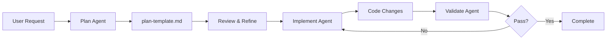

# Custom Agents Framework

This directory contains custom AI agents for specialized development workflows following [VS Code Context Engineering](https://code.visualstudio.com/docs/copilot/guides/context-engineering-guide) patterns.

## Directory Structure

```
.github/
├── agents/                              # Custom agent definitions
│   ├── plan.agent.md                    # Planning agent for feature design
│   ├── implement.agent.md               # TDD implementation agent
│   └── validate.agent.md                # Validation/QA agent
├── prompts/                             # Reusable prompt workflows
│   ├── plan-feature.prompt.md           # Plan from GitHub issue
│   ├── add-entity-type.prompt.md        # Add new entity type
│   ├── add-inference-algorithm.prompt.md # Add relationship inference
│   └── debug-processing.prompt.md       # Troubleshoot RFP processing
├── copilot-instructions.md              # Main AI agent guidance
├── plan-template.md                     # Implementation plan template
└── AGENTS_README.md                     # This file
```

## Two Prompt Systems

This project has **two separate prompt systems**:

| System                  | Location   | Purpose                            | Audience       |
| ----------------------- | ---------- | ---------------------------------- | -------------- |
| **Application Prompts** | `prompts/` | Guide RAG system runtime behavior  | xAI Grok LLM   |
| **Codebase Prompts**    | `.github/` | Guide AI agents during development | GitHub Copilot |

### Application Prompts (`prompts/`)

These are **not for you** - they're for the RAG system:

- `prompts/extraction/` - Entity extraction from RFPs (~3,000 lines)
- `prompts/relationship_inference/` - 8 semantic algorithms
- `prompts/user_queries/` - Query templates for capture managers

### Codebase Prompts (`.github/`)

These **are for you** - AI coding agents:

- `agents/*.agent.md` - Specialized agent personalities
- `prompts/*.prompt.md` - Reusable workflow templates
- `copilot-instructions.md` - General coding guidance

---

## Available Agents

### 1. Plan Agent (`agents/plan.agent.md`)

**Purpose**: Analyze requirements and create structured implementation plans

**Use when**:

- Starting work on a GitHub issue
- Breaking down complex features
- Identifying dependencies and risks

**Example**: "Plan the implementation for Issue #27 (Amendment Analyst Agent)"

### 2. Implement Agent (`agents/implement.agent.md`)

**Purpose**: Execute plans using test-driven development

**Use when**:

- Writing new code from a plan
- Adding entity types or inference algorithms
- Creating API endpoints

**Example**: "Implement the diff analysis module from the Amendment plan"

### 3. Validate Agent (`agents/validate.agent.md`)

**Purpose**: Verify implementations meet acceptance criteria

**Use when**:

- Testing completed features
- Running quality checks
- Validating Neo4j data integrity

**Example**: "Validate the entity extraction for the MCPP workspace"

---

## Available Prompts

| Prompt                              | Purpose                              |
| ----------------------------------- | ------------------------------------ |
| `plan-feature.prompt.md`            | Plan from a GitHub issue number      |
| `add-entity-type.prompt.md`         | Add new entity type to ontology      |
| `add-inference-algorithm.prompt.md` | Add relationship inference algorithm |
| `debug-processing.prompt.md`        | Troubleshoot RFP processing issues   |

---

## Relevant GitHub Issues

Based on current open issues, here are candidates for agent-driven development:

| Issue | Feature                             | Agent Workflow                               |
| ----- | ----------------------------------- | -------------------------------------------- |
| #27   | Amendment Analyst Agent             | Plan → Implement → Validate                  |
| #28   | Amendment Comparison API            | Plan → Implement → Validate                  |
| #25   | Shipley Methodology Knowledge Graph | Plan → Research → Implement                  |
| #12   | Custom GovCon Query Prompts         | Plan → Implement (prompts/user_queries/)     |
| #10   | workload_driver Entity Type         | Plan → Implement (add-entity-type.prompt.md) |
| #9    | Entity Extraction Enhancements      | Plan → Implement (prompts/extraction/)       |
| #8    | Dual-Model Reranker                 | Plan → Implement → Validate                  |
| #3    | Table Extraction Retry Logic        | Plan → Implement → Validate                  |

---

## Agent Development Workflow



### Example Workflow: Issue #10 (workload_driver Entity Type)

```
1. User: "Add workload_driver entity type (Issue #10)"

2. Plan Agent:
   - Research existing entity types in schema.py
   - Identify patterns for similar types
   - Create implementation plan using add-entity-type.prompt.md

3. Implement Agent:
   - Add Pydantic model to src/ontology/schema.py
   - Add to entity_types list in src/server/config.py
   - Update prompts/extraction/entity_extraction_prompt.md
   - Write test in tests/test_json_extraction.py

4. Validate Agent:
   - Run pytest tests/test_json_extraction.py -v
   - Verify entity type consistency
   - Check extraction works on sample text
```

---

## Best Practices

### Context Management

- **Start small**: Begin with minimal context, add detail based on AI behavior
- **Keep fresh**: Update documentation as codebase evolves
- **Progressive building**: High-level concepts first, then details

### Documentation Strategies

- **Living documents**: Refine agents based on observed mistakes
- **Decision context**: Prioritize architectural decisions over exhaustive details
- **Consistent patterns**: Document conventions for consistent code generation

### Workflow Optimization

- **Handoffs**: Create guided transitions between agents
- **Feedback loops**: Validate AI understanding early
- **Incremental complexity**: Build features step-by-step
- **Separate concerns**: Different agents for different activities

---

## Creating New Agents

To create a new specialized agent:

1. Create `agents/[name].agent.md` following this structure:

```markdown
# [Agent Name] Agent

You are a [role] for the GovCon Capture Vibe project.

## Your Expertise

- [Domain 1]
- [Domain 2]

## When Activated

Use this agent when:

- [Scenario 1]
- [Scenario 2]

## Workflow

### Step 1: [Action]

[Details]

### Step 2: [Action]

[Details]

## Key Files to Reference

| Area   | Files           |
| ------ | --------------- |
| [Area] | `path/to/files` |
```

2. Update this README with the new agent

3. Create corresponding prompt files if needed

---

## Related Resources

- [VS Code Context Engineering Guide](https://code.visualstudio.com/docs/copilot/guides/context-engineering-guide)
- [Custom Agents Documentation](https://code.visualstudio.com/docs/copilot/customization/custom-agents)
- [Prompt Files Documentation](https://code.visualstudio.com/docs/copilot/customization/prompt-files)
- `docs/ARCHITECTURE.md`

---

**Status**: ✅ Active  
**Database**: Neo4j (primary), NetworkX (fallback)  
**Last Updated**: January 2025
